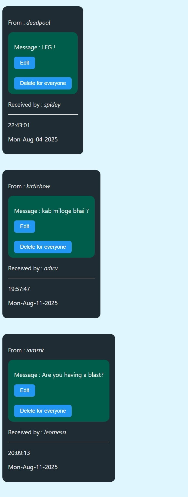
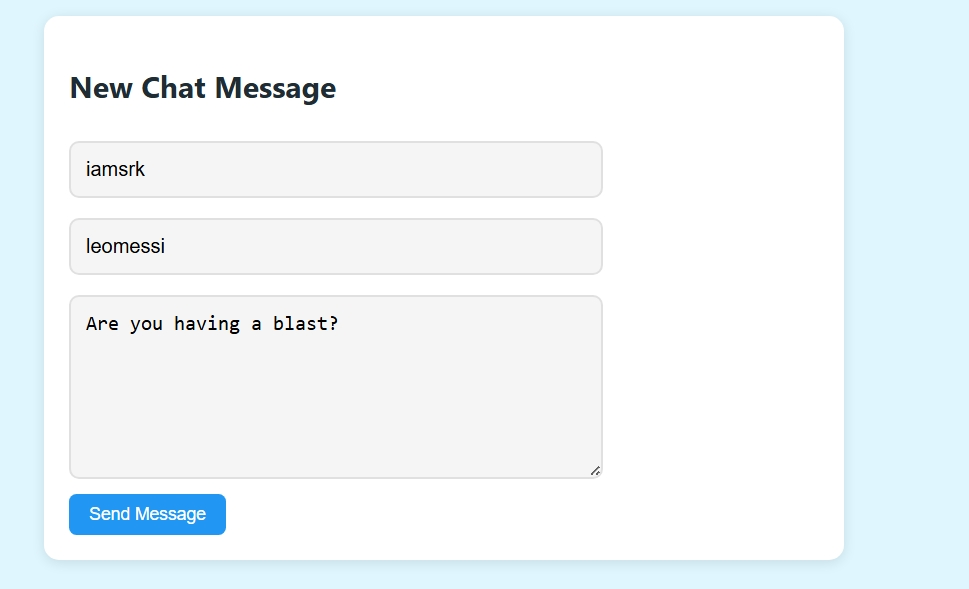

# Mini Whatsapp App

A simple full-stack web application that mimics a mini-Whatsapp chat interface. This project was built to learn and practice fundamental web development concepts.

## Features

* **View All Chats:** See a list of all chat messages on a single page.
* **Create New Chat:** A dedicated form to send a new chat message to another user.
* **Edit Existing Chat:** Easily update the text of a sent message.
* **Delete Chat:** A button to permanently delete a chat message.

---

## What I Learned

* **Node.js & Express:** Setting up and running a web server to handle requests and responses.
* **EJS Templating:** Using EJS to create dynamic HTML pages and inject data from the server.
* **MongoDB & Mongoose:** Connecting a Node.js application to a MongoDB database and performing CRUD operations (Create, Read, Update, Delete).
* **Method-Override:** Using middleware to handle `PUT` and `DELETE` requests from HTML forms.
* **Full-Stack Workflow:** How all the parts—the front-end (EJS, CSS) and the back-end (Express, Mongoose)—work together to create a complete web application.
* **Git & GitHub:** Using Git for version control and pushing the project to a public repository.

---

## Demo

Here's a look at the application in action.

### All Chats Page
A view of the main page where all messages are displayed.



### New Chat Page
The form used to create and send a new message.



---

## How to Make It Your Own

1.  **Clone the Repository:** Fork this repository and clone it to your local machine.
    ```bash
    git clone https://github.com/iamAdil95/mini-whatsapp.git
    ```
2.  **Install Dependencies:** Run the following command in the project directory to install all required packages.
    ```bash
    npm install
    ```
3.  **Set up MongoDB:** Make sure you have a local MongoDB server running. Update the connection string in `index.js` if needed.
4.  **Run the Server:** Start the application using nodemon for automatic restarts.
    ```bash
    nodemon index.js
    ```
5.  **View in Browser:** Open your browser and navigate to `http://localhost:8080/chats` to see the application.

